# Esperanza 2K26

> **The annual inter-college cultural festival of Vel Tech Multi Tech, Chennai.**  
> Live on **March 6th, 2026** — Dance · Music · Short Films · Arts & more.

🌐 **Live Site:** [esperanza2k26.vercel.app](https://esperanza2k26.vercel.app)

---

## 📁 Project Structure

```
esperanza2k26/
├── frontend/                   # Next.js web application
│   ├── src/
│   │   ├── app/                # Pages, layouts & routes (App Router)
│   │   ├── components/         # Reusable UI components & sections
│   │   ├── hooks/              # Custom React hooks
│   │   ├── context/            # React context providers
│   │   ├── lib/                # Utility functions
│   │   ├── types/              # TypeScript type definitions
│   │   ├── data/               # Static data & constants
│   │   └── icons/              # SVG icon components
│   ├── public/                 # Static assets (images, videos, logos)
│   ├── package.json
│   ├── next.config.ts
│   ├── tsconfig.json
│   ├── postcss.config.mjs
│   ├── eslint.config.mjs
│   └── components.json         # Shadcn UI config
│
├── backend/                    # Express.js REST API
│   ├── server.js               # Main server entry point
│   ├── seed_events.js          # Database seeder script
│   ├── package.json
│   └── .env                    # Environment variables (not committed)
│
└── logs/                       # Build & debug logs (dev only)
```

---

## 🛠️ Tech Stack

| Layer       | Technology                                                |
|-------------|-----------------------------------------------------------|
| **Frontend** | Next.js 15, React 19, TypeScript, Tailwind CSS v4       |
| **UI**       | Shadcn UI, Radix UI, Framer Motion, GSAP, Lucide Icons  |
| **Backend**  | Node.js, Express.js                                      |
| **Database** | MongoDB, Mongoose                                        |
| **Storage**  | Cloudinary (images, videos, PDFs)                        |
| **Email**    | Nodemailer (Gmail SMTP)                                  |
| **Fonts**    | Inter, Bricolage Grotesque, Manrope, Anton, Poppins      |
| **Analytics**| Google Tag Manager                                       |
| **Hosting**  | Vercel (frontend), Render (backend)                      |

---

## 🚀 Getting Started

### Prerequisites

- **Node.js** v20+
- **npm** v10+
- A **MongoDB** database (Atlas or local)
- A **Cloudinary** account
- A **Gmail** account for email notifications

---

### 1. Clone the Repository

```bash
git clone https://github.com/Jeevith-Devs/esperanza2k26.git
cd esperanza2k26
```

---

### 2. Backend Setup

```bash
cd backend
npm install
```

Create a `.env` file inside the `backend/` folder:

```env
MONGO_URI=your_mongodb_connection_string
CLOUDINARY_CLOUD_NAME=your_cloud_name
CLOUDINARY_API_KEY=your_api_key
CLOUDINARY_API_SECRET=your_api_secret
EMAIL_USER=your_gmail@gmail.com
EMAIL_PASS=your_gmail_app_password
ADMIN_PASS=your_admin_password
PORT=5000
```

Start the backend server:

```bash
npm start
```

> API runs at `http://localhost:5000`

---

### 3. Frontend Setup

```bash
cd frontend
npm install
```

Create a `.env.local` file inside the `frontend/` folder:

```env
NEXT_PUBLIC_API_URL=http://localhost:5000/api
```

Start the development server:

```bash
npm run dev
```

> App runs at `http://localhost:3000`

---

## 📡 API Endpoints

| Method | Endpoint                           | Description                        |
|--------|------------------------------------|------------------------------------|
| `POST` | `/api/upload`                      | Upload file to Cloudinary          |
| `POST` | `/api/register`                    | Submit event registration          |
| `GET`  | `/api/events`                      | Get all events                     |
| `GET`  | `/api/content`                     | Get CMS content (prices, UPI, etc) |
| `POST` | `/api/admin/login`                 | Admin authentication               |
| `GET`  | `/api/admin/registrations`         | Get all registrations (admin)      |
| `POST` | `/api/admin/verify-registration`   | Approve / reject registration      |

---

## ✨ Key Features

- 🎟️ **Event Registration** — Solo & team registration with payment screenshot upload
- ✅ **Admin Dashboard** — Verify registrations, manage events, gallery & content
- 📧 **Email Notifications** — Automated confirmation emails with entry pass on approval
- 🖼️ **Gallery** — Dynamic photo & video gallery managed via admin panel
- 📱 **Fully Responsive** — Mobile-first design with smooth animations
- 🔍 **SEO Optimized** — Open Graph, Twitter Cards, JSON-LD structured data
- 🌐 **Google Analytics** — Integrated Google Tag Manager

---

## 🧾 Available Scripts

### Frontend (`/frontend`)

| Command         | Description                        |
|-----------------|------------------------------------|
| `npm run dev`   | Start development server           |
| `npm run build` | Build for production               |
| `npm run start` | Run production build               |
| `npm run lint`  | Run ESLint                         |

### Backend (`/backend`)

| Command       | Description                    |
|---------------|--------------------------------|
| `npm start`   | Start the Express server       |

---

## 📸 Screenshots

| | | |
|:---:|:---:|:---:|
| 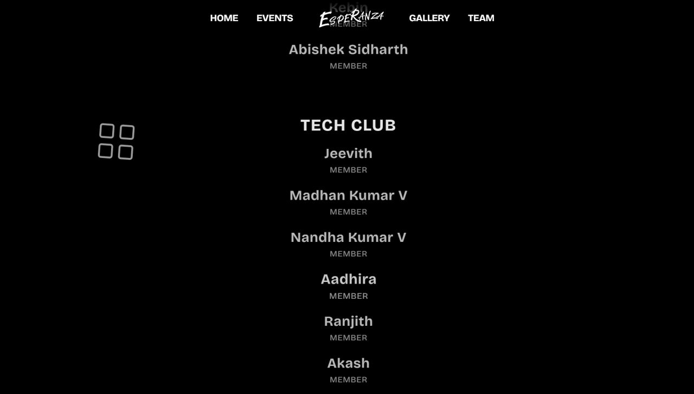 | 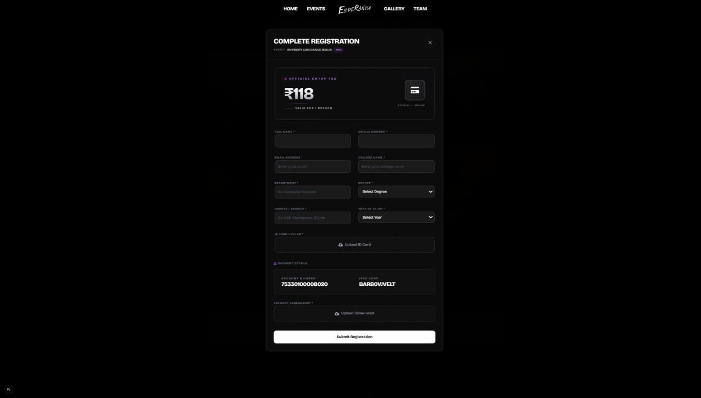 | 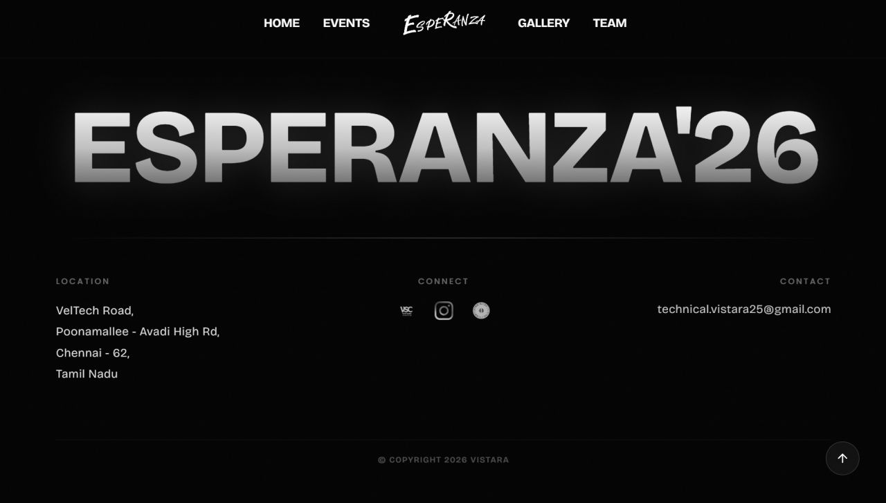 |
| 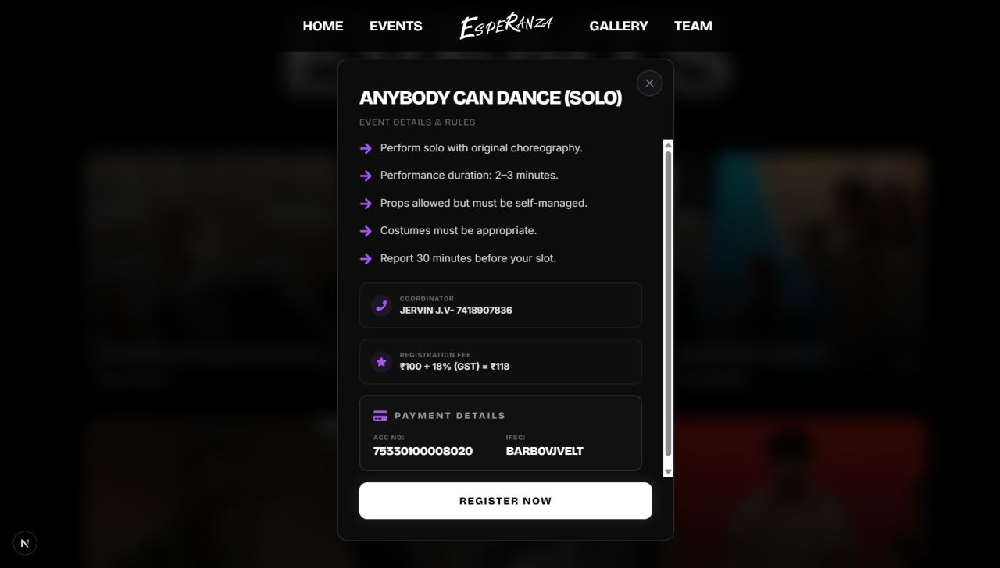 | 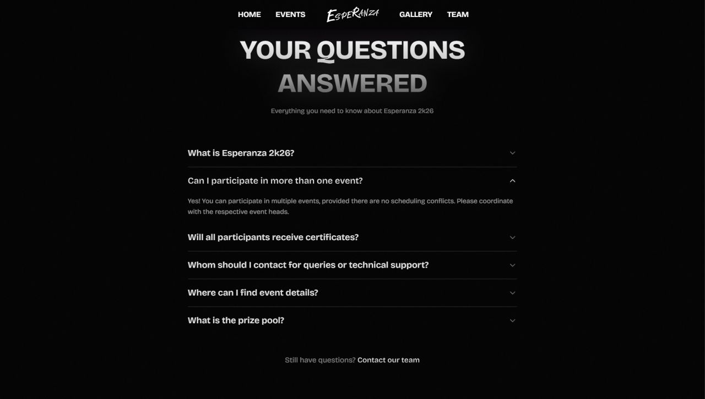 | 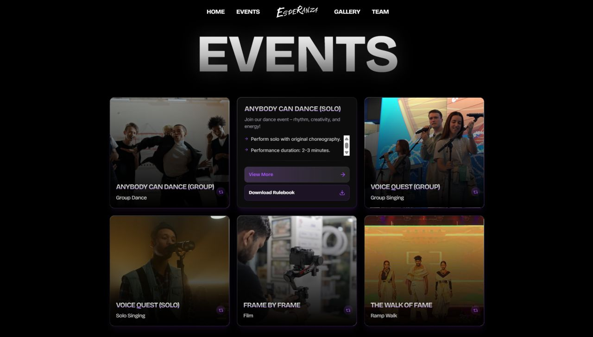 |
| 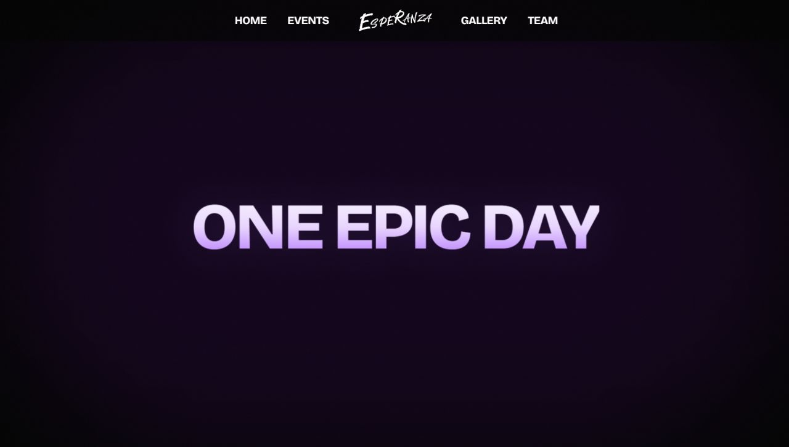 | 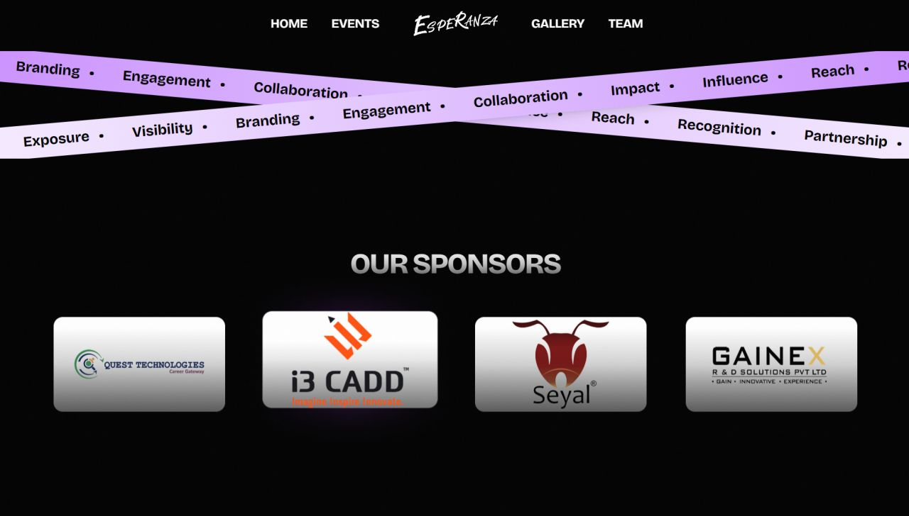 | 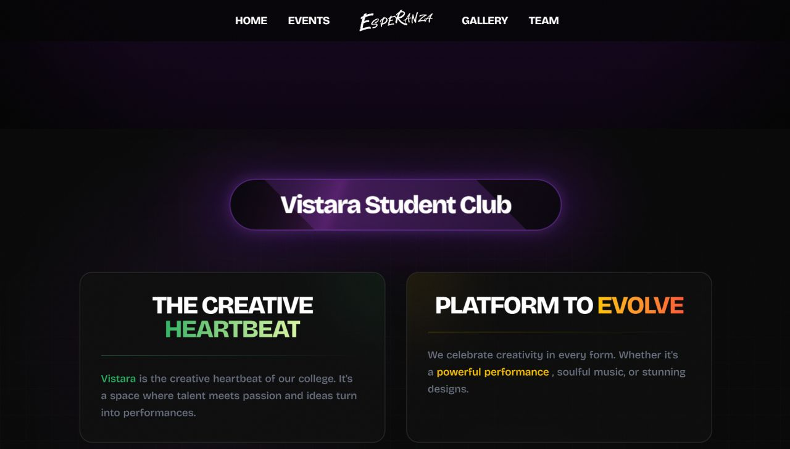 |
| 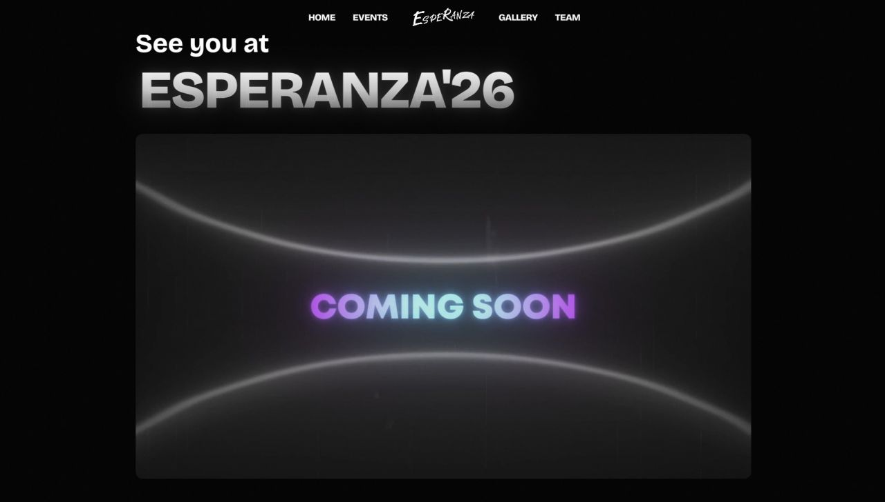 | 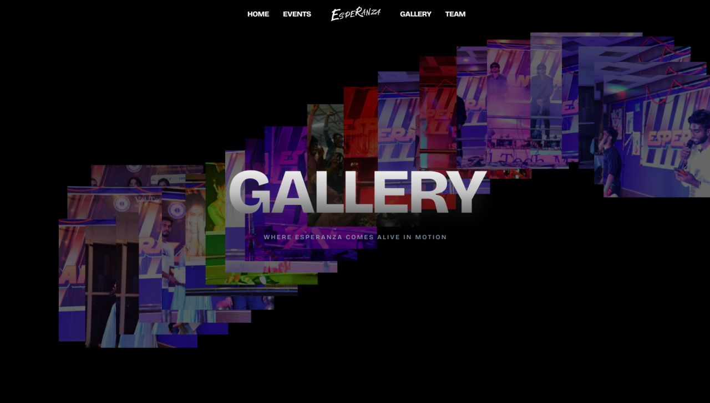 | 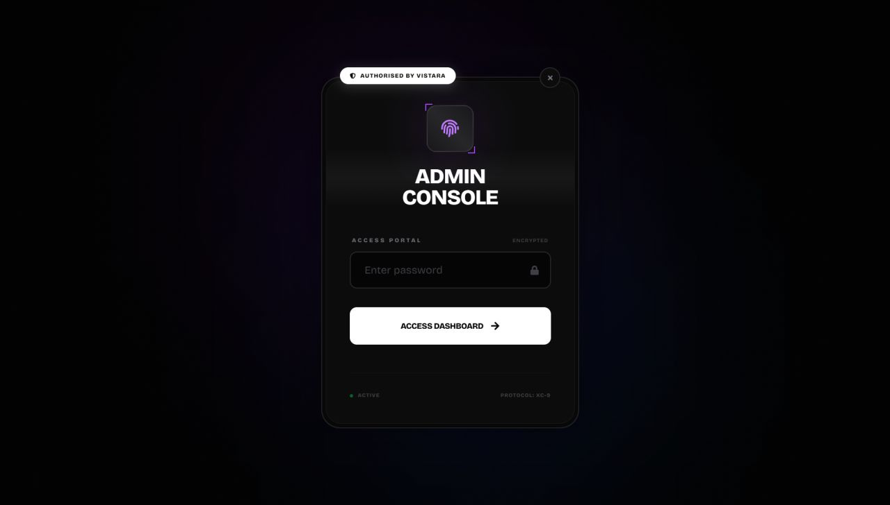 |
| 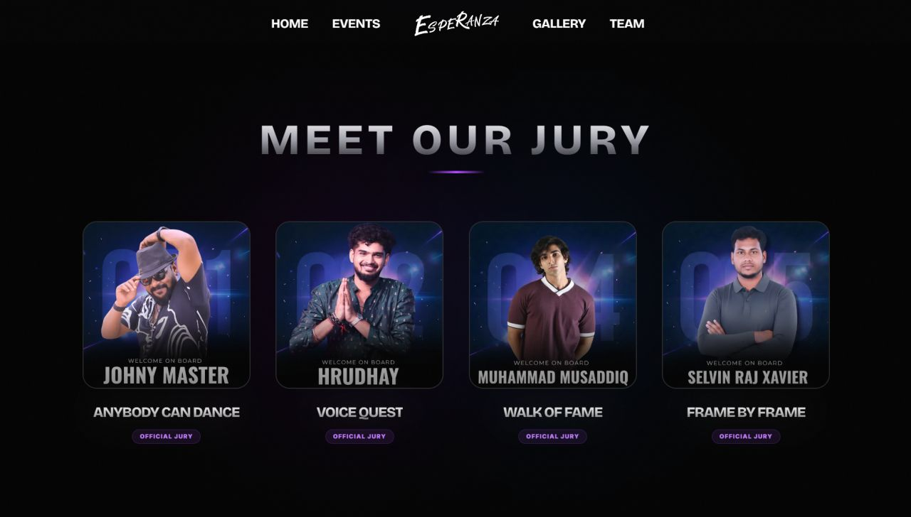 | 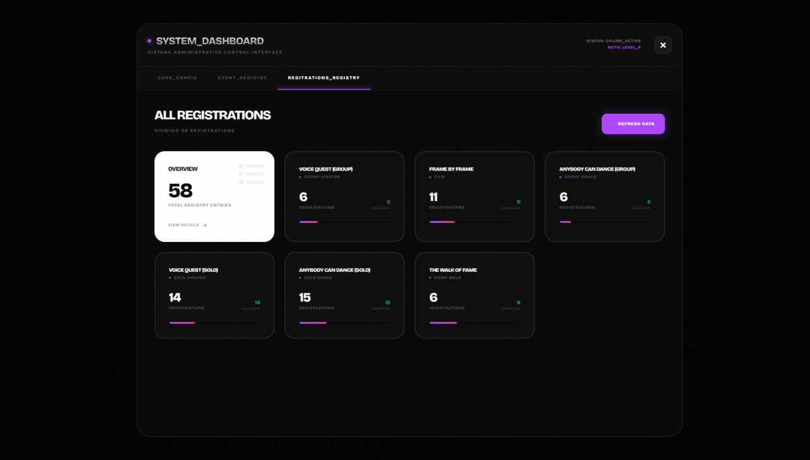 | 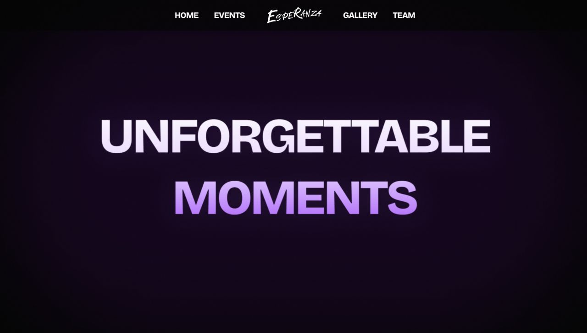 |
| 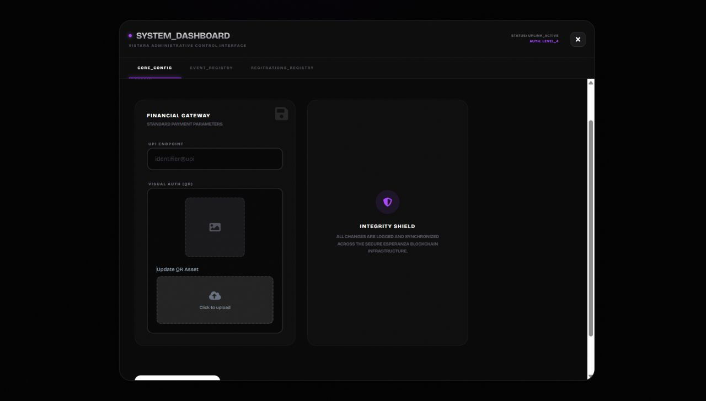 | 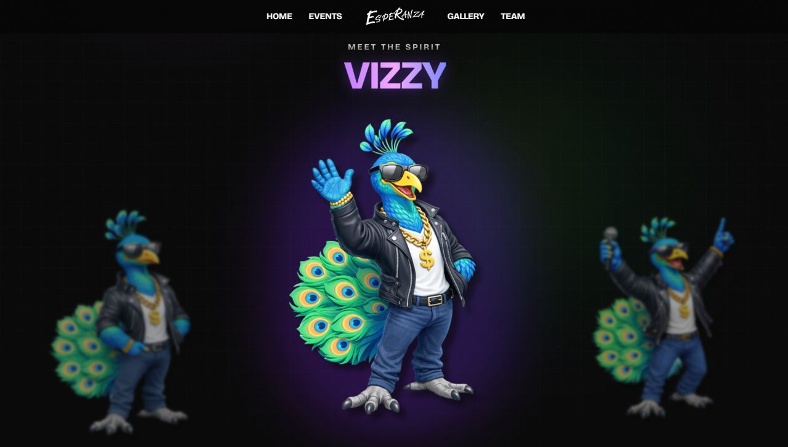 | 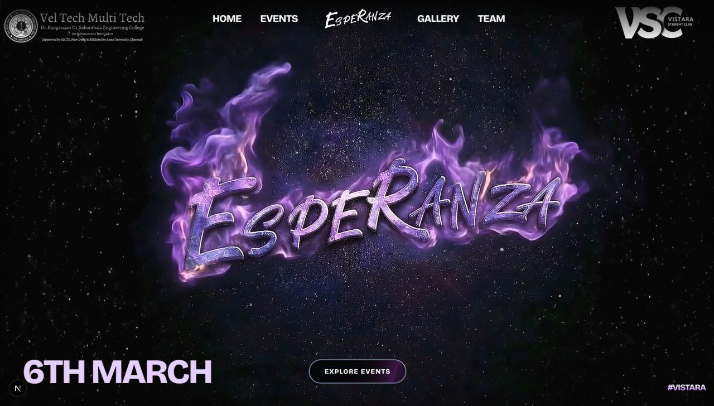 |

---

**Vistara Student Club**  
Vel Tech Multi Tech — Avadi, Chennai, Tamil Nadu, India  
📧 [technical.vistara25@gmail.com](mailto:technical.vistara25@gmail.com)